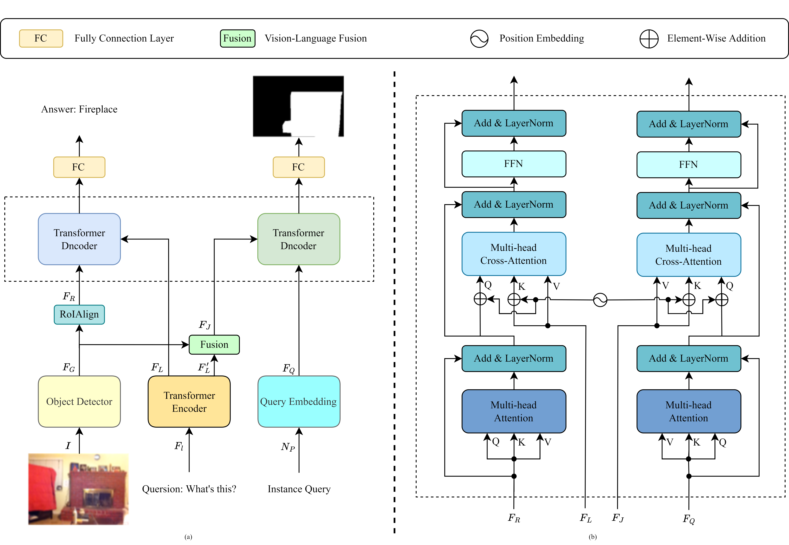

# DDTN: Dual-decoder transformer network for answer grounding in visual question answering
 

This is the official implementation of [Dual-decoder transformer network for answer grounding in visual question answering](https://doi.org/10.1016/j.patrec.2023.04.003), which introduces an simple framework for answer grounding in visual question answering under the Transformer network.   


## Updates
2022.8.6 We create this project for our paper. Thanks for your attention.

2023.4.16 Our paper: Dual-decoder transformer network for answer grounding in visual question answering has been accepted by ***Rattern Recognition Letters***. The code will be released shortly.

2023.5.21 The code is available.

## Installation
### Prerequisites
```
conda create -n DDTN python=3.7
conda activate DDTN
git clone https://github.com/zlj63501/DDTN.git
pip install -r requirements.txt
cd mmf
pip install --editable .
```

### Data Preparation

1. Download the VizWiz-VQA-Grounding images from [VizWiz](https://vizwiz.org/tasks-and-datasets/answer-grounding-for-vqa/).
2. Download the annotations and weights from [Google Drive](https://drive.google.com/drive/folders/1V6cmRd1JR-8PWDIq53xXmzzl3Bhj-u2b?usp=sharing).
3. Extract the image grid and region features, according to the repository [VinVl](https://github.com/pzzhang/VinVL).

The data structure should look like the following:

```
| -- DDTN
     | -- data
        | -- annotations
            -- train.npy
            -- val.npy
            -- test.npy
            -- answers.txt
            -- vocabulary_100K.txt
        | -- weights
            | -- resnet_head.pth
        | -- features
            | -- train
                | -- VizWiz_train_00000000.npz
                | -- ...
            | -- val
                | -- VizWiz_val_00000001.npz
                | -- ...
            | -- test
                | -- VizWiz_test_00000002.npz
                | -- ...
     ...
```

## Training
We train DDTN to perform grouning and answering at instance level on a single TiTan X GPU with 12 GB memory. The following script performs the training:
```
python mmf_cli/run.py config=projects/ddtn/configs/defaults.yaml run_type=train_val dataset=vizwiz model=ddtn
```

## Evaluation
```
python mmf_cli/run.py config=projects/fve_loc/configs/defaults.yaml run_type=val dataset=vizwiz model=ddtn checkpoint.resume_file=save/models/xxx.ckpt
```

## Citation

```
@article{ZHU202353,
title = {Dual-decoder transformer network for answer grounding in visual question answering},
journal = {Pattern Recognition Letters},
volume = {171},
pages = {53-60},
year = {2023},
issn = {0167-8655},
doi = {https://doi.org/10.1016/j.patrec.2023.04.003},
url = {https://www.sciencedirect.com/science/article/pii/S0167865523001046},
author = {Liangjun Zhu and Li Peng and Weinan Zhou and Jielong Yang}
}
```

## Acknowledgement

Our code is built upon the open-sourced [MMF](https://github.com/facebookresearch/mmf), [mmdetection](https://github.com/open-mmlab/mmdetection), [SeqTR](https://github.com/sean-zhuh/SeqTR) and [VinVl](https://github.com/pzzhang/VinVL) libraries. 
